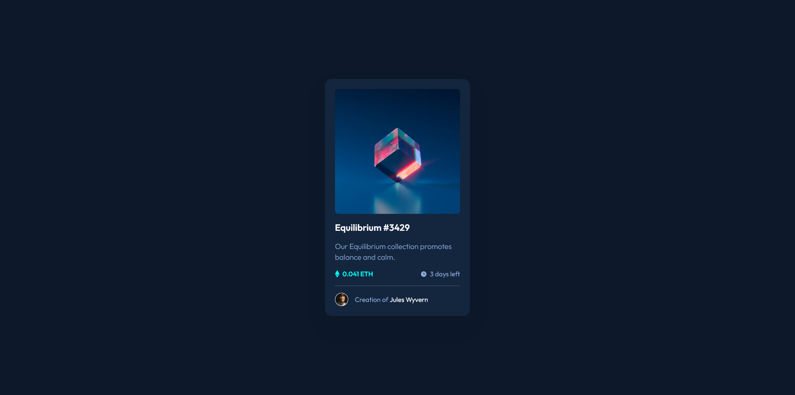
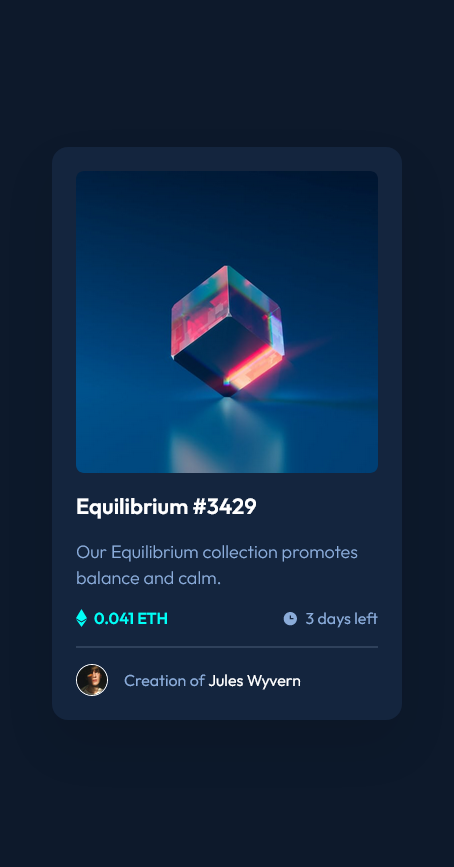

# Frontend Mentor - QR code component solution

This is a solution to the [QR code component challenge on Frontend Mentor](https://www.frontendmentor.io/challenges/qr-code-component-iux_sIO_H). Frontend Mentor challenges help you improve your coding skills by building realistic projects.

## Table of contents

- [Overview](#overview)
  - [Screenshots](#screenshots)
    - [Desktop solution](#desktop-solution)
    - [Mobile solution](#mobile-solution)
  - [Links](#links)
- [My process](#my-process)
  - [Built with](#built-with)
  - [What I learned](#what-i-learned)
  - [Continued development](#continued-development)
  - [Useful resources](#useful-resources)
- [Author](#author)

## Overview

### Screenshots

#### Desktop solution

#### Mobile solution

### Links

- Live Site URL: [https://almanzarsaul.github.io/frontend-mentor-nft-preview-card/](https://almanzarsaul.github.io/frontend-mentor-nft-preview-card/)

## My process

This was my first project using Frontend Mentor's PRO subscription. Having design file was extremely helpful and greatly increased my development speed. Having to build off of a .JPG was not very fun.

### Built with

- Semantic HTML5
- Figma design file
- CSS custom properties
- CSS Grid
- CSS Flex
- Mobile-first workflow

### What I learned

- How to create an overlay on hover for an image.

### Continued development

In the future I would like to hone in on proper semantic HTML with a focus on accessibility and BEM CSS conventions.

### Useful resources

- [Josh W Comeau's CSS Reset](https://www.joshwcomeau.com/css/custom-css-reset/) - Great way to start from scratch without browser defaults.
- [W3 School](https://www.w3schools.com/howto/howto_css_image_overlay.asp) - Where I learned to create an overlay for images on hover.

## Author

- GitHub - [Saul Almanzar](https://github.com/almanzarsaul)
- Frontend Mentor - [@almanzarsaul](https://www.frontendmentor.io/profile/almanzarsaul)
